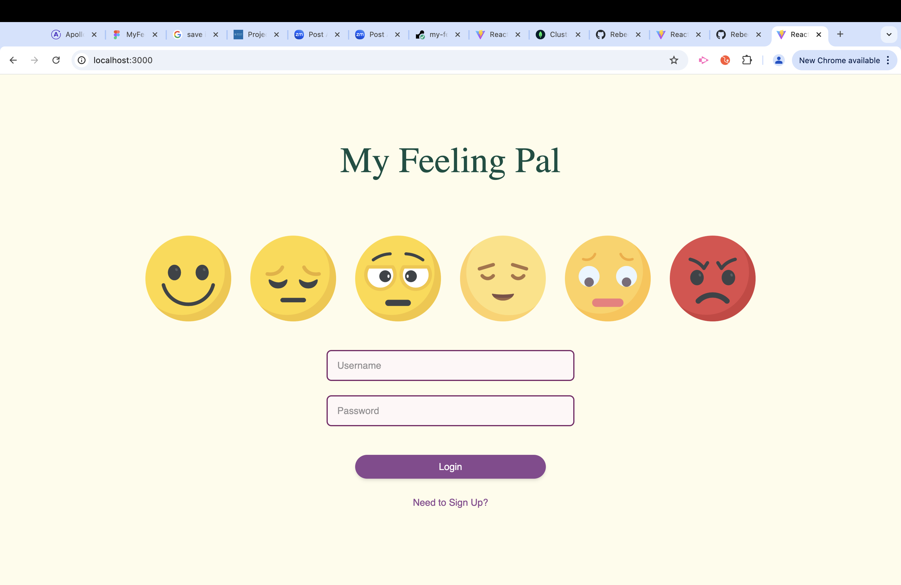
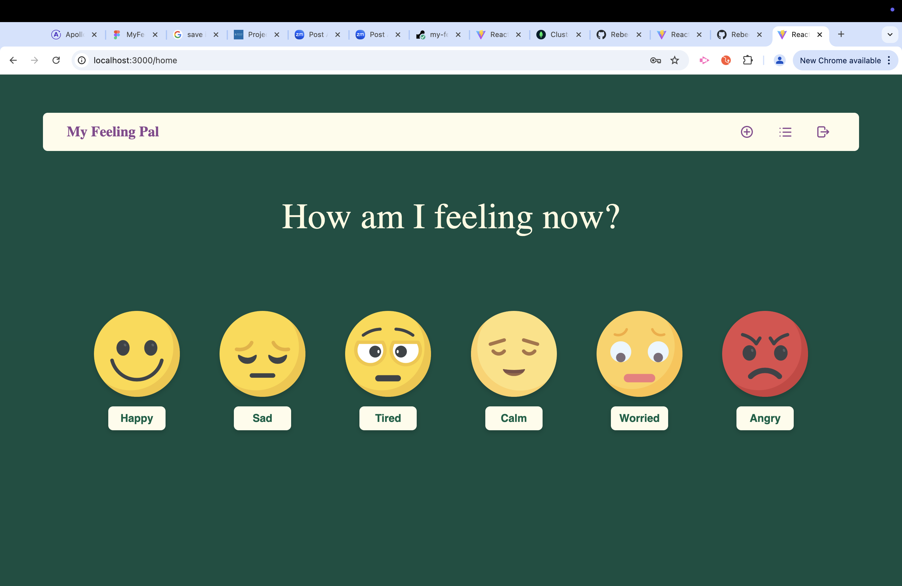
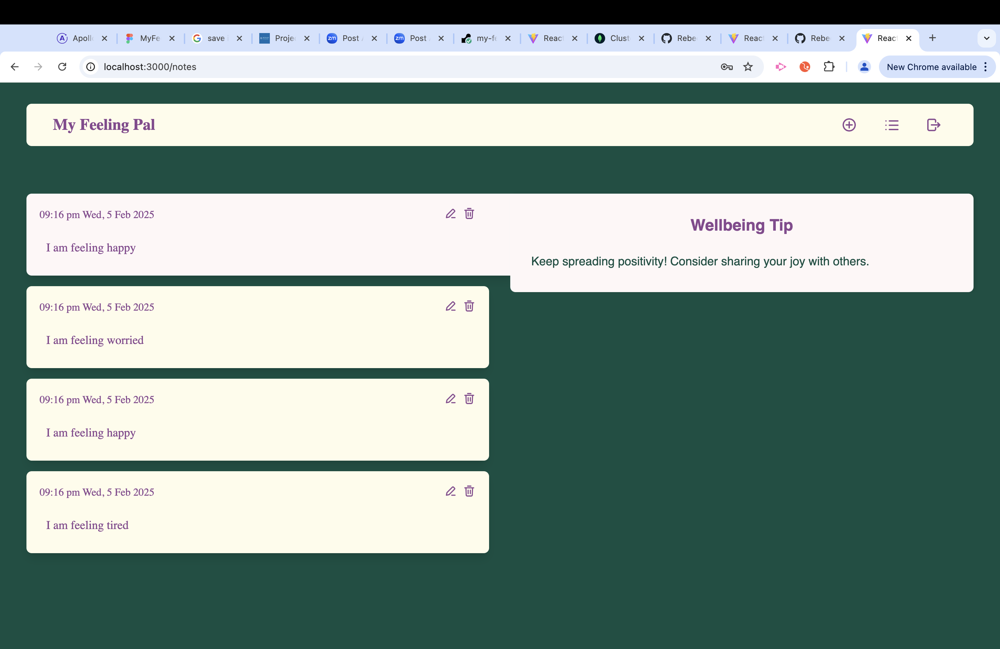

# My Feeling Pal 🌈

## Description
My Feeling Pal is an emotional wellness tracker that helps users monitor and reflect on their daily feelings. Users can log their emotional states (happy, sad, tired, calm, worried, or angry) and receive personalized wellbeing tips based on their current mood. This application provides a simple, intuitive interface for emotional self-awareness and mental health support.

## Technologies Used
- **Frontend:**
  - React
  - TypeScript
  - Apollo Client
  - TailwindCSS
  - Vite

- **Backend:**
  - Node.js
  - Express
  - GraphQL
  - MongoDB
  - JWT Authentication

## Features
- 🔐 Secure user authentication
- 😊 Six different emotion tracking options
- 📝 Personalized wellbeing tips
- 📱 Responsive design
- 📊 Emotion history tracking

## Screenshots

### Login Page

### Sign Up Page

### Home Page - Emotion Selection

### Note List Page - Dashboard with Wellbeing Tips

## Links
- [Deployed Application](https://my-feeling-pal.onrender.com)
- [GitHub Repository](https://github.com/RebeccaZhu29/my-feeling-pal)

## Getting Started
1. Clone the repository
2. Install dependencies for both client and server
3. Set up MongoDB connection
4. Configure environment variables
5. Run the development servers
